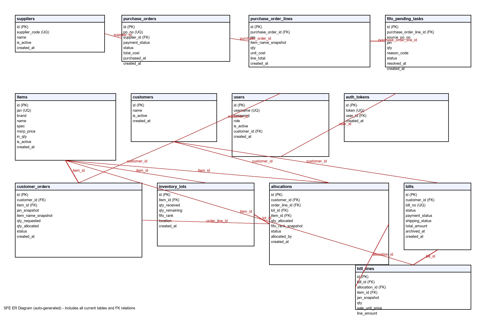

# SFE 项目 Markdown 内容清单

统计时间：2026-02-26 04:20:40 (Asia/Tokyo)
总计：274 个 MD 文件

- `.pytest_cache/README.md`
  - 标题/首行：pytest cache directory #
  - 内容摘要：This directory contains data from the pytest's cache plugin, | which provides the `--lf` and `--ff` options, as well as the `cache` fixture.
- `.venv/Lib/site-packages/httpcore-1.0.9.dist-info/licenses/LICENSE.md`
  - 标题/首行：Copyright © 2020, [Encode OSS Ltd](https://www.encode.io/).
  - 内容摘要：Copyright © 2020, [Encode OSS Ltd](https://www.encode.io/). | All rights reserved.
- `.venv/Lib/site-packages/httpx-0.27.2.dist-info/licenses/LICENSE.md`
  - 标题/首行：Copyright © 2019, [Encode OSS Ltd](https://www.encode.io/).
  - 内容摘要：Copyright © 2019, [Encode OSS Ltd](https://www.encode.io/). | All rights reserved.
- `.venv/Lib/site-packages/idna-3.11.dist-info/licenses/LICENSE.md`
  - 标题/首行：BSD 3-Clause License
  - 内容摘要：BSD 3-Clause License | Copyright (c) 2013-2025, Kim Davies and contributors.
- `.venv/Lib/site-packages/numpy/random/LICENSE.md`
  - 标题/首行：NCSA Open Source License
  - 内容摘要：**This software is dual-licensed under the The University of Illinois/NCSA | Open Source License (NCSA) and The 3-Clause BSD License**
- `.venv/Lib/site-packages/numpy-2.4.2.dist-info/licenses/numpy/_core/src/npysort/x86-simd-sort/LICENSE.md`
  - 标题/首行：BSD 3-Clause License
  - 内容摘要：BSD 3-Clause License | Copyright (c) 2022, Intel. All rights reserved.
- `.venv/Lib/site-packages/numpy-2.4.2.dist-info/licenses/numpy/fft/pocketfft/LICENSE.md`
  - 标题/首行：Copyright (C) 2010-2018 Max-Planck-Society
  - 内容摘要：Copyright (C) 2010-2018 Max-Planck-Society | All rights reserved.
- `.venv/Lib/site-packages/numpy-2.4.2.dist-info/licenses/numpy/random/LICENSE.md`
  - 标题/首行：NCSA Open Source License
  - 内容摘要：**This software is dual-licensed under the The University of Illinois/NCSA | Open Source License (NCSA) and The 3-Clause BSD License**
- `.venv/Lib/site-packages/numpy-2.4.2.dist-info/licenses/numpy/random/src/distributions/LICENSE.md`
  - 标题/首行：NumPy
  - 内容摘要：Copyright (c) 2005-2017, NumPy Developers. | All rights reserved.
- `.venv/Lib/site-packages/numpy-2.4.2.dist-info/licenses/numpy/random/src/mt19937/LICENSE.md`
  - 标题/首行：MT19937
  - 内容摘要：Copyright (c) 2003-2005, Jean-Sebastien Roy (js@jeannot.org) | The rk_random and rk_seed functions algorithms and the original design of
- `.venv/Lib/site-packages/numpy-2.4.2.dist-info/licenses/numpy/random/src/pcg64/LICENSE.md`
  - 标题/首行：PCG64
  - 内容摘要：PCG Random Number Generation for C. | Copyright 2014 Melissa O'Neill <oneill@pcg-random.org>
- `.venv/Lib/site-packages/numpy-2.4.2.dist-info/licenses/numpy/random/src/philox/LICENSE.md`
  - 标题/首行：PHILOX
  - 内容摘要：Copyright 2010-2012, D. E. Shaw Research. | All rights reserved.
- `.venv/Lib/site-packages/numpy-2.4.2.dist-info/licenses/numpy/random/src/sfc64/LICENSE.md`
  - 标题/首行：SFC64
  - 内容摘要：Adapted from a C++ implementation of Chris Doty-Humphrey's SFC PRNG. | https://gist.github.com/imneme/f1f7821f07cf76504a97f6537c818083
- `.venv/Lib/site-packages/numpy-2.4.2.dist-info/licenses/numpy/random/src/splitmix64/LICENSE.md`
  - 标题/首行：SPLITMIX64
  - 内容摘要：Written in 2015 by Sebastiano Vigna (vigna@acm.org) | To the extent possible under law, the author has dedicated all copyright
- `.venv/Lib/site-packages/pyparsing/ai/best_practices.md`
  - 标题/首行：Planning
  - 内容摘要：<!-- | This file contains instructions for best practices for developing parsers with pyparsing, and can be used by AI agents
- `.venv/Lib/site-packages/starlette-0.38.6.dist-info/licenses/LICENSE.md`
  - 标题/首行：Copyright © 2018, [Encode OSS Ltd](https://www.encode.io/).
  - 内容摘要：Copyright © 2018, [Encode OSS Ltd](https://www.encode.io/). | All rights reserved.
- `.venv/Lib/site-packages/uvicorn-0.30.6.dist-info/licenses/LICENSE.md`
  - 标题/首行：Copyright © 2017-present, [Encode OSS Ltd](https://www.encode.io/).
  - 内容摘要：Copyright © 2017-present, [Encode OSS Ltd](https://www.encode.io/). | All rights reserved.
- `docs/BUSINESS_DATA_SPEC.md`
  - 标题/首行：SFE 业务与数据结构统一规范（最终版）
  - 内容摘要：> 本文档为 SFE 项目唯一业务语义与流程约束说明。 | > 目标：统一概念、消除歧义、固化流程与状态守卫，作为后续开发与审计基线。
- `docs/DATABASE_ER.md`
  - 标题/首行：SFE Database ER Diagram
  - 内容摘要： | Generated from current project tables and FK relations.
- `docs/FIFO_LOGIC.md`
  - 标题/首行：FIFO 业务逻辑说明（当前实现）
  - 内容摘要：本文档描述 SFE 项目中“进货单盘点完成后”的 FIFO 分配与挂起规则。 | 在超级管理员「进货单管理」页面，点击某进货单的【盘点完成】按钮：
- `docs/OPERATION_MANUAL.md`
  - 标题/首行：SFE 操作手册（非IT版）
  - 内容摘要：1. 打开 VS Code 终端，进入 `C:\sfe-system` | 2. 运行后端：
- `docs/OPERATION_TRACE.md`
  - 标题/首行：SFE 操作轨迹报告（简版，非技术版）
  - 内容摘要：我已按你的业务框架，做出一套可以跑通的“后端+前端”最小闭环系统： | - 客户下单（订单）
- `docs/OPTIMIZATION_REFERENCE.md`
  - 标题/首行：SFE 优化参考（仅方案评估，不改代码与数据）
  - 内容摘要：> 目标：在**完全保证现有功能**前提下，对 SFE 的业务链路与数据组织进行压缩与简化，供后续迭代参考。 | > 范围：本文件仅为优化参考，不包含任何实施改动。
- `docs/PROJECT_CONFIG.md`
  - 标题/首行：SFE 项目配置
  - 内容摘要：- 系统默认币种：`JPY` | - 显示货币：日元（円）
- `docs/SFE_DATABASE_SPEC.md`
  - 标题/首行：SFE 数据库说明（自动生成）
  - 内容摘要：- 生成时间: 2026-02-26 04:04:39 | - 数据库文件: `C:\sfe-system\sfe.db`
- `docs/SFE_DATABASE_SPEC_TEXT.md`
  - 标题/首行：SFE 数据库说明（纯文本版，可直接复制）
  - 内容摘要：生成时间：2026-02-26 04:10:48 | 数据库文件：C:\sfe-system\sfe.db
- `frontend/node_modules/@ant-design/colors/README.md`
  - 标题/首行：Install
  - 内容摘要：<h1 align="center">Ant Design Colors</h1> | <div align="center">
- `frontend/node_modules/@ant-design/cssinjs/LICENSE.md`
  - 标题/首行：The MIT License (MIT)
  - 内容摘要：The MIT License (MIT) | Copyright (c) 2019-present afc163
- `frontend/node_modules/@ant-design/cssinjs/README.md`
  - 标题/首行：@ant-design/cssinjs
  - 内容摘要：[![NPM version][npm-image]][npm-url] [![npm download][download-image]][download-url] [](https://github.co
- `frontend/node_modules/@ant-design/cssinjs-utils/README.md`
  - 标题/首行：@ant-design/cssinjs-utils
  - 内容摘要：A cssinjs util library to support Ant Design (antd) and its ecosystem libraries. | ``` bash
- `frontend/node_modules/@ant-design/fast-color/README.md`
  - 标题/首行：@ant-design/fast-color
  - 内容摘要：Fast Color Class | [![NPM version][npm-image]][npm-url]
- `frontend/node_modules/@ant-design/icons/docs/demo/all-icons.md`
  - 标题/首行：all-icons
  - 内容摘要：<code src="../examples/all-icons.tsx">
- `frontend/node_modules/@ant-design/icons/docs/demo/ant-design-twotone-demo.md`
  - 标题/首行：ant-design-twotone-demo
  - 内容摘要：<code src="../examples/ant-design-twotone-demo.tsx">
- `frontend/node_modules/@ant-design/icons/docs/demo/basic.md`
  - 标题/首行：basic
  - 内容摘要：<code src="../examples/basic.tsx">
- `frontend/node_modules/@ant-design/icons/docs/demo/custom-icon.md`
  - 标题/首行：custom-icon
  - 内容摘要：<code src="../examples/custom-icon.tsx">
- `frontend/node_modules/@ant-design/icons/docs/demo/loadModules.md`
  - 标题/首行：loadModules
  - 内容摘要：<code src="../examples/loadModules.tsx">
- `frontend/node_modules/@ant-design/icons/docs/demo/root-class.md`
  - 标题/首行：Root ClassName
  - 内容摘要：<code src="../examples/root-class.tsx">
- `frontend/node_modules/@ant-design/icons/docs/demo/simple.md`
  - 标题/首行：simple
  - 内容摘要：<code src="../examples/simple.tsx">
- `frontend/node_modules/@ant-design/icons/docs/demo/tooltip.md`
  - 标题/首行：tooltip
  - 内容摘要：<code src="../examples/tooltip.tsx">
- `frontend/node_modules/@ant-design/icons/docs/demo/two-tone.md`
  - 标题/首行：two-tone
  - 内容摘要：<code src="../examples/two-tone.tsx">
- `frontend/node_modules/@ant-design/icons/docs/demo/use-iconfontcn.md`
  - 标题/首行：use-iconfontcn
  - 内容摘要：<code src="../examples/use-iconfontcn.tsx">
- `frontend/node_modules/@ant-design/icons/README.md`
  - 标题/首行：Ant Design Icons for React
  - 内容摘要：[](https://npmjs.org/package/@ant-design/icons) [](#backers) [ for more information.
- `frontend/node_modules/@babel/compat-data/README.md`
  - 标题/首行：@babel/compat-data
  - 内容摘要：> The compat-data to determine required Babel plugins | See our website [@babel/compat-data](https://babeljs.io/docs/babel-compat-data) for more information.
- `frontend/node_modules/@babel/core/README.md`
  - 标题/首行：@babel/core
  - 内容摘要：> Babel compiler core. | See our website [@babel/core](https://babeljs.io/docs/babel-core) for more information or the [issues](https://github.com/babel/babel/issues?utf8=%E2%9C%93
- `frontend/node_modules/@babel/generator/README.md`
  - 标题/首行：@babel/generator
  - 内容摘要：> Turns an AST into code. | See our website [@babel/generator](https://babeljs.io/docs/babel-generator) for more information or the [issues](https://github.com/babel/babel/issues?u
- `frontend/node_modules/@babel/helper-compilation-targets/README.md`
  - 标题/首行：@babel/helper-compilation-targets
  - 内容摘要：> Helper functions on Babel compilation targets | See our website [@babel/helper-compilation-targets](https://babeljs.io/docs/babel-helper-compilation-targets) for more information
- `frontend/node_modules/@babel/helper-globals/README.md`
  - 标题/首行：@babel/helper-globals
  - 内容摘要：> A collection of JavaScript globals for Babel internal usage | See our website [@babel/helper-globals](https://babeljs.io/docs/babel-helper-globals) for more information.
- `frontend/node_modules/@babel/helper-module-imports/README.md`
  - 标题/首行：@babel/helper-module-imports
  - 内容摘要：> Babel helper functions for inserting module loads | See our website [@babel/helper-module-imports](https://babeljs.io/docs/babel-helper-module-imports) for more information.
- `frontend/node_modules/@babel/helper-module-transforms/README.md`
  - 标题/首行：@babel/helper-module-transforms
  - 内容摘要：> Babel helper functions for implementing ES6 module transformations | See our website [@babel/helper-module-transforms](https://babeljs.io/docs/babel-helper-module-transforms) for
- `frontend/node_modules/@babel/helper-plugin-utils/README.md`
  - 标题/首行：@babel/helper-plugin-utils
  - 内容摘要：> General utilities for plugins to use | See our website [@babel/helper-plugin-utils](https://babeljs.io/docs/babel-helper-plugin-utils) for more information.
- `frontend/node_modules/@babel/helper-string-parser/README.md`
  - 标题/首行：@babel/helper-string-parser
  - 内容摘要：> A utility package to parse strings | See our website [@babel/helper-string-parser](https://babeljs.io/docs/babel-helper-string-parser) for more information.
- `frontend/node_modules/@babel/helper-validator-identifier/README.md`
  - 标题/首行：@babel/helper-validator-identifier
  - 内容摘要：> Validate identifier/keywords name | See our website [@babel/helper-validator-identifier](https://babeljs.io/docs/babel-helper-validator-identifier) for more information.
- `frontend/node_modules/@babel/helper-validator-option/README.md`
  - 标题/首行：@babel/helper-validator-option
  - 内容摘要：> Validate plugin/preset options | See our website [@babel/helper-validator-option](https://babeljs.io/docs/babel-helper-validator-option) for more information.
- `frontend/node_modules/@babel/helpers/README.md`
  - 标题/首行：@babel/helpers
  - 内容摘要：> Collection of helper functions used by Babel transforms. | See our website [@babel/helpers](https://babeljs.io/docs/babel-helpers) for more information.
- `frontend/node_modules/@babel/parser/CHANGELOG.md`
  - 标题/首行：Changelog
  - 内容摘要：> **Tags:** | > - :boom:       [Breaking Change]
- `frontend/node_modules/@babel/parser/README.md`
  - 标题/首行：@babel/parser
  - 内容摘要：> A JavaScript parser | See our website [@babel/parser](https://babeljs.io/docs/babel-parser) for more information or the [issues](https://github.com/babel/babel/issues?utf8=%E2%9C
- `frontend/node_modules/@babel/plugin-transform-react-jsx-self/README.md`
  - 标题/首行：@babel/plugin-transform-react-jsx-self
  - 内容摘要：> Add a __self prop to all JSX Elements | See our website [@babel/plugin-transform-react-jsx-self](https://babeljs.io/docs/babel-plugin-transform-react-jsx-self) for more informati
- `frontend/node_modules/@babel/plugin-transform-react-jsx-source/README.md`
  - 标题/首行：@babel/plugin-transform-react-jsx-source
  - 内容摘要：> Add a __source prop to all JSX Elements | See our website [@babel/plugin-transform-react-jsx-source](https://babeljs.io/docs/babel-plugin-transform-react-jsx-source) for more inf
- `frontend/node_modules/@babel/runtime/README.md`
  - 标题/首行：@babel/runtime
  - 内容摘要：> babel's modular runtime helpers | See our website [@babel/runtime](https://babeljs.io/docs/babel-runtime) for more information.
- `frontend/node_modules/@babel/template/README.md`
  - 标题/首行：@babel/template
  - 内容摘要：> Generate an AST from a string template. | See our website [@babel/template](https://babeljs.io/docs/babel-template) for more information or the [issues](https://github.com/babel/
- `frontend/node_modules/@babel/traverse/README.md`
  - 标题/首行：@babel/traverse
  - 内容摘要：> The Babel Traverse module maintains the overall tree state, and is responsible for replacing, removing, and adding nodes | See our website [@babel/traverse](https://babeljs.io/do
- `frontend/node_modules/@babel/types/README.md`
  - 标题/首行：@babel/types
  - 内容摘要：> Babel Types is a Lodash-esque utility library for AST nodes | See our website [@babel/types](https://babeljs.io/docs/babel-types) for more information or the [issues](https://git
- `frontend/node_modules/@emotion/hash/CHANGELOG.md`
  - 标题/首行：@emotion/hash
  - 内容摘要：- [`446e756`](https://github.com/emotion-js/emotion/commit/446e75661c4aa01e51d1466472a212940c19cd82) [#1775](https://github.com/emotion-js/emotion/pull/1775) Thanks [@kripod](https
- `frontend/node_modules/@emotion/hash/README.md`
  - 标题/首行：@emotion/hash
  - 内容摘要：> A MurmurHash2 implementation | ```jsx
- `frontend/node_modules/@emotion/unitless/CHANGELOG.md`
  - 标题/首行：@emotion/unitless
  - 内容摘要：- [`4c62ae9`](https://github.com/emotion-js/emotion/commit/4c62ae9447959d438928e1a26f76f1487983c968) [#1698](https://github.com/emotion-js/emotion/pull/1698) Thanks [@Andarist](htt
- `frontend/node_modules/@emotion/unitless/README.md`
  - 标题/首行：@emotion/unitless
  - 内容摘要：> An object of css properties that don't accept values with units | ```jsx
- `frontend/node_modules/@esbuild/win32-x64/README.md`
  - 标题/首行：esbuild
  - 内容摘要：This is the Windows 64-bit binary for esbuild, a JavaScript bundler and minifier. See https://github.com/evanw/esbuild for details.
- `frontend/node_modules/@jridgewell/gen-mapping/README.md`
  - 标题/首行：@jridgewell/gen-mapping
  - 内容摘要：> Generate source maps | `gen-mapping` allows you to generate a source map during transpilation or minification.
- `frontend/node_modules/@jridgewell/remapping/README.md`
  - 标题/首行：@jridgewell/remapping
  - 内容摘要：> Remap sequential sourcemaps through transformations to point at the original source code | Remapping allows you to take the sourcemaps generated through transforming your code an
- `frontend/node_modules/@jridgewell/resolve-uri/README.md`
  - 标题/首行：@jridgewell/resolve-uri
  - 内容摘要：> Resolve a URI relative to an optional base URI | Resolve any combination of absolute URIs, protocol-realtive URIs, absolute paths, or relative paths.
- `frontend/node_modules/@jridgewell/sourcemap-codec/README.md`
  - 标题/首行：@jridgewell/sourcemap-codec
  - 内容摘要：Encode/decode the `mappings` property of a [sourcemap](https://docs.google.com/document/d/1U1RGAehQwRypUTovF1KRlpiOFze0b-_2gc6fAH0KY0k/edit). | Sourcemaps are difficult to generate
- `frontend/node_modules/@jridgewell/trace-mapping/README.md`
  - 标题/首行：@jridgewell/trace-mapping
  - 内容摘要：> Trace the original position through a source map | `trace-mapping` allows you to take the line and column of an output file and trace it to the
- `frontend/node_modules/@rc-component/async-validator/LICENSE.md`
  - 标题/首行：The MIT License (MIT)
  - 内容摘要：The MIT License (MIT) | Copyright (c) 2014-present yiminghe
- `frontend/node_modules/@rc-component/async-validator/README.md`
  - 标题/首行：@rc-component/async-validator
  - 内容摘要：[![NPM version][npm-image]][npm-url] | [![npm download][download-image]][download-url]
- `frontend/node_modules/@rc-component/color-picker/LICENSE.md`
  - 标题/首行：The MIT License (MIT)
  - 内容摘要：The MIT License (MIT) | Copyright (c) 2019-present alipay.com
- `frontend/node_modules/@rc-component/color-picker/README.md`
  - 标题/首行：@rc-component/color-picker
  - 内容摘要：React Color Picker. | [![NPM version][npm-image]][npm-url] [](https://github.com/umijs/dumi) [![build sta
- `frontend/node_modules/@rc-component/context/LICENSE.md`
  - 标题/首行：The MIT License (MIT)
  - 内容摘要：The MIT License (MIT) | Copyright (c) 2014-present yiminghe
- `frontend/node_modules/@rc-component/context/README.md`
  - 标题/首行：@rc-component/context
  - 内容摘要：--- | React way perf context selector
- `frontend/node_modules/@rc-component/mini-decimal/README.md`
  - 标题/首行：@rc-component/mini-decimal
  - 内容摘要：React 18 supported Portal Component. | [![NPM version][npm-image]][npm-url] [](https://github.com/umijs/d
- `frontend/node_modules/@rc-component/mutate-observer/README.md`
  - 标题/首行：rc-mutate-observer
  - 内容摘要：MutateObserver for React. | [![NPM version][npm-image]][npm-url] [](https://github.com/umijs/dumi) [![bui
- `frontend/node_modules/@rc-component/portal/README.md`
  - 标题/首行：rc-portal
  - 内容摘要：React 18 supported Portal Component. | [![NPM version][npm-image]][npm-url] [](https://github.com/umijs/d
- `frontend/node_modules/@rc-component/qrcode/README.md`
  - 标题/首行：@rc-component/qrcode
  - 内容摘要：React QRCode Component | [![NPM version][npm-image]][npm-url]
- `frontend/node_modules/@rc-component/tour/README.md`
  - 标题/首行：@rc-component/tour
  - 内容摘要：React 18 supported Tour Component. | [![NPM version][npm-image]][npm-url] [](https://github.com/umijs/dum
- `frontend/node_modules/@rc-component/trigger/README.md`
  - 标题/首行：@rc-component/trigger
  - 内容摘要：React Trigger Component | [![NPM version][npm-image]][npm-url]
- `frontend/node_modules/@reduxjs/toolkit/README.md`
  - 标题/首行：Redux Toolkit
  - 内容摘要： | [.
- `frontend/node_modules/@types/babel__generator/README.md`
  - 标题/首行：Installation
  - 内容摘要：> `npm install --save @types/babel__generator` | This package contains type definitions for @babel/generator (https://github.com/babel/babel/tree/master/packages/babel-generator).
- `frontend/node_modules/@types/babel__template/README.md`
  - 标题/首行：Installation
  - 内容摘要：> `npm install --save @types/babel__template` | This package contains type definitions for @babel/template (https://github.com/babel/babel/tree/master/packages/babel-template).
- `frontend/node_modules/@types/babel__traverse/README.md`
  - 标题/首行：Installation
  - 内容摘要：> `npm install --save @types/babel__traverse` | This package contains type definitions for @babel/traverse (https://github.com/babel/babel/tree/main/packages/babel-traverse).
- `frontend/node_modules/@types/estree/README.md`
  - 标题/首行：Installation
  - 内容摘要：> `npm install --save @types/estree` | This package contains type definitions for estree (https://github.com/estree/estree).
- `frontend/node_modules/@types/use-sync-external-store/README.md`
  - 标题/首行：Installation
  - 内容摘要：> `npm install --save @types/use-sync-external-store` | This package contains type definitions for use-sync-external-store (https://github.com/facebook/react#readme).
- `frontend/node_modules/@vitejs/plugin-react/README.md`
  - 标题/首行：@vitejs/plugin-react [](https://npmjs.com/package/@vitejs/plugin-react)
  - 内容摘要：The default Vite plugin for React projects. | - enable [Fast Refresh](https://www.npmjs.com/package/react-refresh) in development (requires react >= 16.9)
- `frontend/node_modules/antd/README.md`
  - 标题/首行：❤️ Sponsors [](https://opencollective.com/ant-design/contribute/sponsors-218)
  - 内容摘要：<div align="center"><a name="readme-top"></a> | 
- `frontend/node_modules/asynckit/README.md`
  - 标题/首行：asynckit [](https://www.npmjs.com/package/asynckit)
  - 内容摘要：Minimal async jobs utility library, with streams support. | [](https://trav
- `frontend/node_modules/axios/CHANGELOG.md`
  - 标题/首行：Changelog
  - 内容摘要：- **http2:** Use port 443 for HTTPS connections by default. ([#7256](https://github.com/axios/axios/issues/7256)) ([d7e6065](https://github.com/axios/axios/commit/d7e60653460480ffa
- `frontend/node_modules/axios/lib/adapters/README.md`
  - 标题/首行：axios // adapters
  - 内容摘要：The modules under `adapters/` are modules that handle dispatching a request and settling a returned `Promise` once a response is received. | ```js
- `frontend/node_modules/axios/lib/core/README.md`
  - 标题/首行：axios // core
  - 内容摘要：The modules found in `core/` should be modules that are specific to the domain logic of axios. These modules would most likely not make sense to be consumed outside of the axios mo
- `frontend/node_modules/axios/lib/env/README.md`
  - 标题/首行：axios // env
  - 内容摘要：The `data.js` file is updated automatically when the package version is upgrading. Please do not edit it manually.
- `frontend/node_modules/axios/lib/helpers/README.md`
  - 标题/首行：axios // helpers
  - 内容摘要：The modules found in `helpers/` should be generic modules that are _not_ specific to the domain logic of axios. These modules could theoretically be published to npm on their own a
- `frontend/node_modules/axios/MIGRATION_GUIDE.md`
  - 标题/首行：Axios Migration Guide
  - 内容摘要：> **Migrating from Axios 0.x to 1.x** | >
- `frontend/node_modules/axios/README.md`
  - 标题/首行：Table of Contents
  - 内容摘要：<h3 align="center"> 🥇 Gold sponsors <br> </h3> <table align="center" width="100%"><tr width="33.333333333333336%"><td align="center" width="33.333333333333336%"> <a href="https://w
- `frontend/node_modules/baseline-browser-mapping/README.md`
  - 标题/首行：[`baseline-browser-mapping`](https://github.com/web-platform-dx/web-features/packages/baseline-browser-mapping)
  - 内容摘要：By the [W3C WebDX Community Group](https://www.w3.org/community/webdx/) and contributors. | `baseline-browser-mapping` provides:
- `frontend/node_modules/browserslist/README.md`
  - 标题/首行：Browserslist
  - 内容摘要：
- `frontend/node_modules/call-bind-apply-helpers/CHANGELOG.md`
  - 标题/首行：Changelog
  - 内容摘要：All notable changes to this project will be documented in this file. | The format is based on [Keep a Changelog](https://keepachangelog.com/en/1.0.0/)
- `frontend/node_modules/call-bind-apply-helpers/README.md`
  - 标题/首行：call-bind-apply-helpers <sup>[![Version Badge][npm-version-svg]][package-url]</sup>
  - 内容摘要：[![github actions][actions-image]][actions-url] | [![coverage][codecov-image]][codecov-url]
- `frontend/node_modules/caniuse-lite/README.md`
  - 标题/首行：caniuse-lite
  - 内容摘要：A smaller version of caniuse-db, with only the essentials! | Read full docs **[here](https://github.com/browserslist/caniuse-lite#readme)**.
- `frontend/node_modules/classnames/HISTORY.md`
  - 标题/首行：Changelog
  - 内容摘要：- Remove `workspaces` field from package ([#350](https://github.com/JedWatson/classnames/pull/350)) | - Restore ability to pass a TypeScript `interface` ([#341](https://github.com/
- `frontend/node_modules/classnames/README.md`
  - 标题/首行：Classnames
  - 内容摘要：> A simple JavaScript utility for conditionally joining classNames together. | <p>
- `frontend/node_modules/combined-stream/Readme.md`
  - 标题/首行：combined-stream
  - 内容摘要：A stream that emits multiple other streams one after another. | **NB** Currently `combined-stream` works with streams version 1 only. There is ongoing effort to switch this library
- `frontend/node_modules/compute-scroll-into-view/README.md`
  - 标题/首行：Install
  - 内容摘要：[](https://npm-stat.com/charts.html?package=compute-scroll-into-view) | [](https://travis-ci.org/sudodoki/copy-to-clipboard)
  - 内容摘要：Simple module exposing `copy` function that will try to use [execCommand](https://developer.mozilla.org/en-US/docs/Web/API/Document/execCommand#) with fallback to IE-specific `clip
- `frontend/node_modules/csstype/README.md`
  - 标题/首行：CSSType
  - 内容摘要：[](https://www.npmjs.com/package/csstype) | TypeScript and Flow definitions for CSS, generated by [data from MDN](https://github.com
- `frontend/node_modules/dayjs/CHANGELOG.md`
  - 标题/首行：[1.11.19](https://github.com/iamkun/dayjs/compare/v1.11.18...v1.11.19) (2025-10-31)
  - 内容摘要：* added usage warnings for diff + updated unit tests ([#2948](https://github.com/iamkun/dayjs/issues/2948)) ([269a7a9](https://github.com/iamkun/dayjs/commit/269a7a9cf3649b7a4b328e
- `frontend/node_modules/dayjs/README.md`
  - 标题/首行：Getting Started
  - 内容摘要：<div align="center"> | <a href="https://go.warp.dev/dayjs" target="_blank">
- `frontend/node_modules/debug/README.md`
  - 标题/首行：debug
  - 内容摘要：[](#backers) | [](#sponsors)
- `frontend/node_modules/delayed-stream/Readme.md`
  - 标题/首行：delayed-stream
  - 内容摘要：Buffers events from a stream until you are ready to handle them. | ``` bash
- `frontend/node_modules/dunder-proto/CHANGELOG.md`
  - 标题/首行：Changelog
  - 内容摘要：All notable changes to this project will be documented in this file. | The format is based on [Keep a Changelog](https://keepachangelog.com/en/1.0.0/)
- `frontend/node_modules/dunder-proto/README.md`
  - 标题/首行：dunder-proto <sup>[![Version Badge][npm-version-svg]][package-url]</sup>
  - 内容摘要：[![github actions][actions-image]][actions-url] | [![coverage][codecov-image]][codecov-url]
- `frontend/node_modules/electron-to-chromium/README.md`
  - 标题/首行：Made by [@kilianvalkhof](https://twitter.com/kilianvalkhof)
  - 内容摘要：- 💻 [Polypane](https://polypane.app) - Develop responsive websites and apps twice as fast on multiple screens at once | - 🖌️ [Superposition](https://superposition.design) - Kicksta
- `frontend/node_modules/es-define-property/CHANGELOG.md`
  - 标题/首行：Changelog
  - 内容摘要：All notable changes to this project will be documented in this file. | The format is based on [Keep a Changelog](https://keepachangelog.com/en/1.0.0/)
- `frontend/node_modules/es-define-property/README.md`
  - 标题/首行：es-define-property <sup>[![Version Badge][npm-version-svg]][package-url]</sup>
  - 内容摘要：[![github actions][actions-image]][actions-url] | [![coverage][codecov-image]][codecov-url]
- `frontend/node_modules/es-errors/CHANGELOG.md`
  - 标题/首行：Changelog
  - 内容摘要：All notable changes to this project will be documented in this file. | The format is based on [Keep a Changelog](https://keepachangelog.com/en/1.0.0/)
- `frontend/node_modules/es-errors/README.md`
  - 标题/首行：es-errors <sup>[![Version Badge][npm-version-svg]][package-url]</sup>
  - 内容摘要：[![github actions][actions-image]][actions-url] | [![coverage][codecov-image]][codecov-url]
- `frontend/node_modules/es-object-atoms/CHANGELOG.md`
  - 标题/首行：Changelog
  - 内容摘要：All notable changes to this project will be documented in this file. | The format is based on [Keep a Changelog](https://keepachangelog.com/en/1.0.0/)
- `frontend/node_modules/es-object-atoms/README.md`
  - 标题/首行：es-object-atoms <sup>[![Version Badge][npm-version-svg]][package-url]</sup>
  - 内容摘要：[![github actions][actions-image]][actions-url] | [![coverage][codecov-image]][codecov-url]
- `frontend/node_modules/es-set-tostringtag/CHANGELOG.md`
  - 标题/首行：Changelog
  - 内容摘要：All notable changes to this project will be documented in this file. | The format is based on [Keep a Changelog](https://keepachangelog.com/en/1.0.0/)
- `frontend/node_modules/es-set-tostringtag/README.md`
  - 标题/首行：es-set-tostringtag <sup>[![Version Badge][npm-version-svg]][package-url]</sup>
  - 内容摘要：[![github actions][actions-image]][actions-url] | [![coverage][codecov-image]][codecov-url]
- `frontend/node_modules/esbuild/LICENSE.md`
  - 标题/首行：MIT License
  - 内容摘要：MIT License | Copyright (c) 2020 Evan Wallace
- `frontend/node_modules/esbuild/README.md`
  - 标题/首行：esbuild
  - 内容摘要：This is a JavaScript bundler and minifier. See https://github.com/evanw/esbuild and the [JavaScript API documentation](https://esbuild.github.io/api/) for details.
- `frontend/node_modules/escalade/readme.md`
  - 标题/首行：escalade [](https://github.com/lukeed/escalade/actions) [](https://licenses.dev/npm/escalade) [](https://codecov.io/gh/lukeed/escalade)
  - 内容摘要：> A tiny (183B to 210B) and [fast](#benchmarks) utility to ascend parent directories | With [escalade](https://en.wikipedia.org/wiki/Escalade), you can scale parent directories unt
- `frontend/node_modules/follow-redirects/README.md`
  - 标题/首行：Follow Redirects
  - 内容摘要：Drop-in replacement for Node's `http` and `https` modules that automatically follows redirects. | [](https://www.np
- `frontend/node_modules/form-data/CHANGELOG.md`
  - 标题/首行：Changelog
  - 内容摘要：All notable changes to this project will be documented in this file. | The format is based on [Keep a Changelog](https://keepachangelog.com/en/1.0.0/)
- `frontend/node_modules/form-data/README.md`
  - 标题/首行：Form-Data [](https://www.npmjs.com/package/form-data) [](https://gitter.im/form-data/form-data)
  - 内容摘要：A library to create readable ```"multipart/form-data"``` streams. Can be used to submit forms and file uploads to other web applications. | The API of this library is inspired by t
- `frontend/node_modules/function-bind/.github/SECURITY.md`
  - 标题/首行：Security
  - 内容摘要：Please email [@ljharb](https://github.com/ljharb) or see https://tidelift.com/security if you have a potential security vulnerability to report.
- `frontend/node_modules/function-bind/CHANGELOG.md`
  - 标题/首行：Changelog
  - 内容摘要：All notable changes to this project will be documented in this file. | The format is based on [Keep a Changelog](https://keepachangelog.com/en/1.0.0/)
- `frontend/node_modules/function-bind/README.md`
  - 标题/首行：function-bind <sup>[![Version Badge][npm-version-svg]][package-url]</sup>
  - 内容摘要：[![github actions][actions-image]][actions-url] | <!--[![coverage][codecov-image]][codecov-url]-->
- `frontend/node_modules/gensync/README.md`
  - 标题/首行：gensync
  - 内容摘要：This module allows for developers to write common code that can share | implementation details, hiding whether an underlying request happens
- `frontend/node_modules/get-intrinsic/CHANGELOG.md`
  - 标题/首行：Changelog
  - 内容摘要：All notable changes to this project will be documented in this file. | The format is based on [Keep a Changelog](https://keepachangelog.com/en/1.0.0/)
- `frontend/node_modules/get-intrinsic/README.md`
  - 标题/首行：get-intrinsic <sup>[![Version Badge][npm-version-svg]][package-url]</sup>
  - 内容摘要：[![github actions][actions-image]][actions-url] | [![coverage][codecov-image]][codecov-url]
- `frontend/node_modules/get-proto/CHANGELOG.md`
  - 标题/首行：Changelog
  - 内容摘要：All notable changes to this project will be documented in this file. | The format is based on [Keep a Changelog](https://keepachangelog.com/en/1.0.0/)
- `frontend/node_modules/get-proto/README.md`
  - 标题/首行：get-proto <sup>[![Version Badge][npm-version-svg]][package-url]</sup>
  - 内容摘要：[![github actions][actions-image]][actions-url] | [![coverage][codecov-image]][codecov-url]
- `frontend/node_modules/gopd/CHANGELOG.md`
  - 标题/首行：Changelog
  - 内容摘要：All notable changes to this project will be documented in this file. | The format is based on [Keep a Changelog](https://keepachangelog.com/en/1.0.0/)
- `frontend/node_modules/gopd/README.md`
  - 标题/首行：gopd <sup>[![Version Badge][npm-version-svg]][package-url]</sup>
  - 内容摘要：[![github actions][actions-image]][actions-url] | [![coverage][codecov-image]][codecov-url]
- `frontend/node_modules/has-symbols/CHANGELOG.md`
  - 标题/首行：Changelog
  - 内容摘要：All notable changes to this project will be documented in this file. | The format is based on [Keep a Changelog](https://keepachangelog.com/en/1.0.0/)
- `frontend/node_modules/has-symbols/README.md`
  - 标题/首行：has-symbols <sup>[![Version Badge][2]][1]</sup>
  - 内容摘要：[![github actions][actions-image]][actions-url] | [![coverage][codecov-image]][codecov-url]
- `frontend/node_modules/has-tostringtag/CHANGELOG.md`
  - 标题/首行：Changelog
  - 内容摘要：All notable changes to this project will be documented in this file. | The format is based on [Keep a Changelog](https://keepachangelog.com/en/1.0.0/)
- `frontend/node_modules/has-tostringtag/README.md`
  - 标题/首行：has-tostringtag <sup>[![Version Badge][2]][1]</sup>
  - 内容摘要：[![github actions][actions-image]][actions-url] | [![coverage][codecov-image]][codecov-url]
- `frontend/node_modules/hasown/CHANGELOG.md`
  - 标题/首行：Changelog
  - 内容摘要：All notable changes to this project will be documented in this file. | The format is based on [Keep a Changelog](https://keepachangelog.com/en/1.0.0/)
- `frontend/node_modules/hasown/README.md`
  - 标题/首行：hasown <sup>[![Version Badge][npm-version-svg]][package-url]</sup>
  - 内容摘要：[![github actions][actions-image]][actions-url] | [![coverage][codecov-image]][codecov-url]
- `frontend/node_modules/immer/readme.md`
  - 标题/首行：Immer
  - 内容摘要： | [](https://www.npmjs.com/package/immer) [ ###
  - 内容摘要：- Added: Support for ES2018. The only change needed was recognizing the `s` | regex flag.
- `frontend/node_modules/js-tokens/README.md`
  - 标题/首行：`jsTokens` ###
  - 内容摘要：Overview [](https://travis-ci.org/lydell/js-tokens) | ========
- `frontend/node_modules/jsesc/README.md`
  - 标题/首行：jsesc
  - 内容摘要：Given some data, _jsesc_ returns a stringified representation of that data. jsesc is similar to `JSON.stringify()` except: | 1. it outputs JavaScript instead of JSON [by default](#
- `frontend/node_modules/json2mq/README.md`
  - 标题/首行：json2mq
  - 内容摘要：json2mq is used to generate media query string from JSON or javascript object. | npm install json2mq
- `frontend/node_modules/json5/LICENSE.md`
  - 标题/首行：MIT License
  - 内容摘要：MIT License | Copyright (c) 2012-2018 Aseem Kishore, and [others].
- `frontend/node_modules/json5/README.md`
  - 标题/首行：JSON5 – JSON for Humans
  - 内容摘要：[][Build | Status] [](https://travis-ci.org/zertosh/loose-envify) | Fast (and loose) selective `process.env` replacer usin
- `frontend/node_modules/lru-cache/README.md`
  - 标题/首行：lru cache
  - 内容摘要：A cache object that deletes the least-recently-used items. | [](https://travis-ci.org/isaacs/node-lru-
- `frontend/node_modules/math-intrinsics/CHANGELOG.md`
  - 标题/首行：Changelog
  - 内容摘要：All notable changes to this project will be documented in this file. | The format is based on [Keep a Changelog](https://keepachangelog.com/en/1.0.0/)
- `frontend/node_modules/math-intrinsics/README.md`
  - 标题/首行：math-intrinsics <sup>[![Version Badge][npm-version-svg]][package-url]</sup>
  - 内容摘要：[![github actions][actions-image]][actions-url] | [![coverage][codecov-image]][codecov-url]
- `frontend/node_modules/mime-db/HISTORY.md`
  - 标题/首行：1.52.0 / 2022-02-21
  - 内容摘要：1.52.0 / 2022-02-21 | ===================
- `frontend/node_modules/mime-db/README.md`
  - 标题/首行：mime-db
  - 内容摘要：[![NPM Version][npm-version-image]][npm-url] | [![NPM Downloads][npm-downloads-image]][npm-url]
- `frontend/node_modules/mime-types/HISTORY.md`
  - 标题/首行：2.1.35 / 2022-03-12
  - 内容摘要：2.1.35 / 2022-03-12 | ===================
- `frontend/node_modules/mime-types/README.md`
  - 标题/首行：mime-types
  - 内容摘要：[![NPM Version][npm-version-image]][npm-url] | [![NPM Downloads][npm-downloads-image]][npm-url]
- `frontend/node_modules/ms/license.md`
  - 标题/首行：The MIT License (MIT)
  - 内容摘要：The MIT License (MIT) | Copyright (c) 2020 Vercel, Inc.
- `frontend/node_modules/ms/readme.md`
  - 标题/首行：ms
  - 内容摘要： | Use this package to easily convert various time formats to milliseconds.
- `frontend/node_modules/nanoid/README.md`
  - 标题/首行：Nano ID
  - 内容摘要：
- `frontend/node_modules/node-releases/README.md`
  - 标题/首行：Node.js releases data
  - 内容摘要：All data is located in `data` directory. | `data/processed` contains `envs.json` with node.js releases data preprocessed to be used by [Browserslist](https://github.com/ai/browsers
- `frontend/node_modules/picocolors/README.md`
  - 标题/首行：picocolors
  - 内容摘要：The tiniest and the fastest library for terminal output formatting with ANSI colors. | ```javascript
- `frontend/node_modules/postcss/README.md`
  - 标题/首行：PostCSS
  - 内容摘要：
- `frontend/node_modules/rc-input/LICENSE.md`
  - 标题/首行：The MIT License (MIT)
  - 内容摘要：The MIT License (MIT) | Copyright (c) 2019-present afc163
- `frontend/node_modules/rc-input/README.md`
  - 标题/首行：rc-input ⌨️
  - 内容摘要：[![NPM version][npm-image]][npm-url] | [![npm download][download-image]][download-url]
- `frontend/node_modules/rc-input-number/LICENSE.md`
  - 标题/首行：The MIT License (MIT)
  - 内容摘要：The MIT License (MIT) | Copyright (c) 2014-present yiminghe
- `frontend/node_modules/rc-input-number/README.md`
  - 标题/首行：rc-input-number
  - 内容摘要：Input number control. | [![NPM version][npm-image]][npm-url]
- `frontend/node_modules/rc-mentions/LICENSE.md`
  - 标题/首行：The MIT License (MIT)
  - 内容摘要：The MIT License (MIT) | Copyright (c) 2019-present alipay.com
- `frontend/node_modules/rc-mentions/README.md`
  - 标题/首行：rc-mentions
  - 内容摘要：[![NPM version][npm-image]][npm-url] | [![npm download][download-image]][download-url]
- `frontend/node_modules/rc-menu/LICENSE.md`
  - 标题/首行：The MIT License (MIT)
  - 内容摘要：The MIT License (MIT) | Copyright (c) 2014-present yiminghe
- `frontend/node_modules/rc-menu/README.md`
  - 标题/首行：rc-menu
  - 内容摘要：--- | React Menu Component. port from https://github.com/kissyteam/menu
- `frontend/node_modules/rc-motion/LICENSE.md`
  - 标题/首行：The MIT License (MIT)
  - 内容摘要：The MIT License (MIT) | Copyright (c) 2019-present afc163
- `frontend/node_modules/rc-motion/README.md`
  - 标题/首行：rc-motion
  - 内容摘要：<!-- prettier-ignore --> | [![NPM version][npm-image]][npm-url]
- `frontend/node_modules/rc-notification/LICENSE.md`
  - 标题/首行：The MIT License (MIT)
  - 内容摘要：The MIT License (MIT) | Copyright (c) 2014-present yiminghe
- `frontend/node_modules/rc-notification/README.md`
  - 标题/首行：rc-notification
  - 内容摘要：React Notification UI Component | [![NPM version][npm-image]][npm-url] [](https://github.com/umijs/dumi) 
- `frontend/node_modules/rc-overflow/LICENSE.md`
  - 标题/首行：The MIT License (MIT)
  - 内容摘要：The MIT License (MIT) | Copyright (c) 2019-present afc163
- `frontend/node_modules/rc-overflow/README.md`
  - 标题/首行：rc-overflow 🐾
  - 内容摘要：[![NPM version][npm-image]][npm-url] | [![npm download][download-image]][download-url]
- `frontend/node_modules/rc-pagination/LICENSE.md`
  - 标题/首行：The MIT License (MIT)
  - 内容摘要：The MIT License (MIT) | Copyright (c) 2014-present yiminghe
- `frontend/node_modules/rc-pagination/README.md`
  - 标题/首行：rc-pagination
  - 内容摘要：React Pagination Component. | [![NPM version][npm-image]][npm-url]
- `frontend/node_modules/rc-picker/LICENSE.md`
  - 标题/首行：The MIT License (MIT)
  - 内容摘要：The MIT License (MIT) | Copyright (c) 2019-present afc163
- `frontend/node_modules/rc-picker/README.md`
  - 标题/首行：rc-picker
  - 内容摘要：[![NPM version][npm-image]][npm-url] [![build status][github-actions-image]][github-actions-url] [![Codecov][codecov-image]][codecov-url] [![npm download][download-image]][download
- `frontend/node_modules/rc-progress/LICENSE.md`
  - 标题/首行：The MIT License (MIT)
  - 内容摘要：The MIT License (MIT) | Copyright (c) 2014-present yiminghe
- `frontend/node_modules/rc-progress/README.md`
  - 标题/首行：rc-progress
  - 内容摘要：Progress Bar. | [![NPM version][npm-image]][npm-url] [](https://github.com/umijs/dumi) [![build status][g
- `frontend/node_modules/rc-rate/LICENSE.md`
  - 标题/首行：The MIT License (MIT)
  - 内容摘要：The MIT License (MIT) | Copyright (c) 2014-present yiminghe
- `frontend/node_modules/rc-rate/README.md`
  - 标题/首行：rc-rate
  - 内容摘要：React Rate Component | [![NPM version][npm-image]][npm-url]
- `frontend/node_modules/rc-resize-observer/LICENSE.md`
  - 标题/首行：The MIT License (MIT)
  - 内容摘要：The MIT License (MIT) | Copyright (c) 2019-present afc163
- `frontend/node_modules/rc-resize-observer/README.md`
  - 标题/首行：rc-resize-observer
  - 内容摘要：[![NPM version][npm-image]][npm-url] [](https://github.com/umijs/dumi) [![build status][github-actions-im
- `frontend/node_modules/rc-segmented/LICENSE.md`
  - 标题/首行：The MIT License (MIT)
  - 内容摘要：The MIT License (MIT) | Copyright (c) 2019-present afc163
- `frontend/node_modules/rc-segmented/README.md`
  - 标题/首行：rc-segmented
  - 内容摘要：[![NPM version][npm-image]][npm-url] [![npm download][download-image]][download-url] [](https://github.co
- `frontend/node_modules/rc-select/LICENSE.md`
  - 标题/首行：The MIT License (MIT)
  - 内容摘要：The MIT License (MIT) | Copyright (c) 2014-present alipay.com
- `frontend/node_modules/rc-select/README.md`
  - 标题/首行：rc-select
  - 内容摘要：--- | React Select Component.
- `frontend/node_modules/rc-slider/README.md`
  - 标题/首行：rc-slider
  - 内容摘要：Slider UI component for React | [![NPM version][npm-image]][npm-url]
- `frontend/node_modules/rc-steps/LICENSE.md`
  - 标题/首行：The MIT License (MIT)
  - 内容摘要：The MIT License (MIT) | Copyright (c) 2014-present yiminghe
- `frontend/node_modules/rc-steps/README.md`
  - 标题/首行：rc-steps
  - 内容摘要：--- | React steps component.
- `frontend/node_modules/rc-switch/LICENSE.md`
  - 标题/首行：The MIT License (MIT)
  - 内容摘要：The MIT License (MIT) | Copyright (c) 2014-present yiminghe
- `frontend/node_modules/rc-switch/README.md`
  - 标题/首行：rc-switch
  - 内容摘要：--- | Switch ui component for react.
- `frontend/node_modules/rc-table/LICENSE.md`
  - 标题/首行：MIT LICENSE
  - 内容摘要：MIT LICENSE | Copyright (c) 2015-present Alipay.com, https://www.alipay.com/
- `frontend/node_modules/rc-table/README.md`
  - 标题/首行：rc-table
  - 内容摘要：React table component with useful functions. | [![NPM version][npm-image]][npm-url] [](https://github.com
- `frontend/node_modules/rc-tabs/LICENSE.md`
  - 标题/首行：The MIT License (MIT)
  - 内容摘要：The MIT License (MIT) | Copyright (c) 2014-present yiminghe
- `frontend/node_modules/rc-tabs/README.md`
  - 标题/首行：rc-tabs
  - 内容摘要：--- | React Tabs component.
- `frontend/node_modules/rc-textarea/LICENSE.md`
  - 标题/首行：The MIT License (MIT)
  - 内容摘要：The MIT License (MIT) | Copyright (c) 2019-present afc163
- `frontend/node_modules/rc-textarea/README.md`
  - 标题/首行：rc-textarea
  - 内容摘要：[![NPM version][npm-image]][npm-url] [](https://github.com/umijs/dumi) [![npm download][download-image]][
- `frontend/node_modules/rc-tooltip/README.md`
  - 标题/首行：rc-tooltip
  - 内容摘要：React Tooltip | [![NPM version][npm-image]][npm-url]
- `frontend/node_modules/rc-tree/LICENSE.md`
  - 标题/首行：MIT LICENSE
  - 内容摘要：MIT LICENSE | Copyright (c) 2015-present Alipay.com, https://www.alipay.com/
- `frontend/node_modules/rc-tree/README.md`
  - 标题/首行：rc-tree
  - 内容摘要：Tree component. | [![NPM version][npm-image]][npm-url]
- `frontend/node_modules/rc-tree-select/LICENSE.md`
  - 标题/首行：MIT LICENSE
  - 内容摘要：MIT LICENSE | Copyright (c) 2015-present Alipay.com, https://www.alipay.com/
- `frontend/node_modules/rc-tree-select/README.md`
  - 标题/首行：rc-tree-select
  - 内容摘要：React TreeSelect Component | <!-- prettier-ignore -->
- `frontend/node_modules/rc-upload/README.md`
  - 标题/首行：rc-upload
  - 内容摘要：React Upload | [![NPM version][npm-image]][npm-url]
- `frontend/node_modules/rc-util/README.md`
  - 标题/首行：rc-util
  - 内容摘要：Common Utils For React Component. | [![NPM version][npm-image]][npm-url]
- `frontend/node_modules/rc-virtual-list/README.md`
  - 标题/首行：rc-virtual-list
  - 内容摘要：React Virtual List Component which worked with animation. | [![NPM version][npm-image]][npm-url] [](https
- `frontend/node_modules/react/README.md`
  - 标题/首行：`react`
  - 内容摘要：React is a JavaScript library for creating user interfaces. | The `react` package contains only the functionality necessary to define React components. It is typically used togethe
- `frontend/node_modules/react-dom/README.md`
  - 标题/首行：`react-dom`
  - 内容摘要：This package serves as the entry point to the DOM and server renderers for React. It is intended to be paired with the generic React package, which is shipped as `react` to npm. | 
- `frontend/node_modules/react-is/README.md`
  - 标题/首行：`react-is`
  - 内容摘要：This package allows you to test arbitrary values and see if they're a particular React element type. | ```sh
- `frontend/node_modules/react-redux/LICENSE.md`
  - 标题/首行：The MIT License (MIT)
  - 内容摘要：The MIT License (MIT) | Copyright (c) 2015-present Dan Abramov
- `frontend/node_modules/react-redux/README.md`
  - 标题/首行：React Redux
  - 内容摘要：Official React bindings for [Redux](https://github.com/reduxjs/redux). | Performant and flexible.
- `frontend/node_modules/react-refresh/README.md`
  - 标题/首行：react-refresh
  - 内容摘要：This package implements the wiring necessary to integrate Fast Refresh into bundlers. Fast Refresh is a feature that lets you edit React components in a running application without
- `frontend/node_modules/redux/LICENSE.md`
  - 标题/首行：The MIT License (MIT)
  - 内容摘要：The MIT License (MIT) | Copyright (c) 2015-present Dan Abramov
- `frontend/node_modules/redux/README.md`
  - 标题/首行：<a href='https://redux.js.org'></a>
  - 内容摘要：Redux is a predictable state container for JavaScript apps. | It helps you write applications that behave consistently, run in different environments (client, server, and native), 
- `frontend/node_modules/redux-thunk/LICENSE.md`
  - 标题/首行：The MIT License (MIT)
  - 内容摘要：The MIT License (MIT) | Copyright (c) 2015-present Dan Abramov
- `frontend/node_modules/redux-thunk/README.md`
  - 标题/首行：Redux Thunk
  - 内容摘要：Thunk [middleware](https://redux.js.org/tutorials/fundamentals/part-4-store#middleware) for Redux. It allows writing functions with logic inside that can interact with a Redux stor
- `frontend/node_modules/reselect/README.md`
  - 标题/首行：Reselect
  - 内容摘要：[![npm package][npm-badge]][npm][![Coveralls][coveralls-badge]][coveralls][![GitHub Workflow Status][build-badge]][build]![TypeScript][typescript-badge] | A library for creating me
- `frontend/node_modules/resize-observer-polyfill/README.md`
  - 标题/首行：Installation
  - 内容摘要：ResizeObserver Polyfill | =============
- `frontend/node_modules/rollup/LICENSE.md`
  - 标题/首行：Rollup core license
  - 内容摘要：Rollup is released under the MIT license: | The MIT License (MIT)
- `frontend/node_modules/rollup/README.md`
  - 标题/首行：Overview
  - 内容摘要：<p align="center"> | <a href="https://rollupjs.org/"></a>
- `frontend/node_modules/scheduler/README.md`
  - 标题/首行：`scheduler`
  - 内容摘要：This is a package for cooperative scheduling in a browser environment. It is currently used internally by React, but we plan to make it more generic. | The public API for this pack
- `frontend/node_modules/scroll-into-view-if-needed/README.md`
  - 标题/首行：[Demo](https://scroll-into-view.dev)
  - 内容摘要：[](https://npm-stat.com/charts.html?package=scroll-into-view-if-needed) | [![npm version]
- `frontend/node_modules/semver/README.md`
  - 标题/首行：Install
  - 内容摘要：semver(1) -- The semantic versioner for npm | ===========================================
- `frontend/node_modules/source-map-js/README.md`
  - 标题/首行：Source Map JS
  - 内容摘要：[](https://www.npmjs.com/package/source-map-js) | Difference between original [source-map](https://gi
- `frontend/node_modules/string-convert/README.md`
  - 标题/首行：hyphen2camel
  - 内容摘要：string-convert | ==============
- `frontend/node_modules/stylis/README.md`
  - 标题/首行：STYLIS
  - 内容摘要：[](https://github.com/thysultan/stylis.js) | A Light–weight CSS Preprocessor.
- `frontend/node_modules/throttle-debounce/CHANGELOG.md`
  - 标题/首行：Changelog
  - 内容摘要：-   Pin karma-webpack to specific version to prevent errors in Node 12 | -   License to single license (MIT)
- `frontend/node_modules/throttle-debounce/LICENSE.md`
  - 标题/首行：Copyright (c) Ivan Nikolić <http://ivannikolic.com>
  - 内容摘要：Copyright (c) Ivan Nikolić <http://ivannikolic.com> | Permission is hereby granted, free of charge, to any person obtaining a copy
- `frontend/node_modules/throttle-debounce/README.md`
  - 标题/首行：throttle-debounce
  - 内容摘要：[![Build Status][ci-img]][ci] | [![BrowserStack Status][browserstack-img]][browserstack]
- `frontend/node_modules/toggle-selection/README.md`
  - 标题/首行：Toggle Selection
  - 内容摘要：Simple module exposing function that deselects current browser selection and returns function that restores selection. | ```
- `frontend/node_modules/update-browserslist-db/README.md`
  - 标题/首行：Update Browserslist DB
  - 内容摘要：
- `frontend/node_modules/use-sync-external-store/README.md`
  - 标题/首行：use-sync-external-store
  - 内容摘要：Backwards-compatible shim for [`React.useSyncExternalStore`](https://reactjs.org/docs/hooks-reference.html#usesyncexternalstore). Works with any React that supports Hooks. | See al
- `frontend/node_modules/vite/LICENSE.md`
  - 标题/首行：Vite core license
  - 内容摘要：Vite is released under the MIT license: | MIT License
- `frontend/node_modules/vite/README.md`
  - 标题/首行：vite ⚡
  - 内容摘要：> Next Generation Frontend Tooling | - 💡 Instant Server Start
- `frontend/node_modules/yallist/README.md`
  - 标题/首行：yallist
  - 内容摘要：Yet Another Linked List | There are many doubly-linked list implementations like it, but this
- `README.md`
  - 标题/首行：SFE System
  - 内容摘要：- 后端：FastAPI + SQLAlchemy，完成 订单→到货→FIFO分配→账单→状态推进 闭环 | - 前端：React + Ant Design + Redux Toolkit 可视化看板
- `venv/Lib/site-packages/idna-3.11.dist-info/licenses/LICENSE.md`
  - 标题/首行：BSD 3-Clause License
  - 内容摘要：BSD 3-Clause License | Copyright (c) 2013-2025, Kim Davies and contributors.
- `venv/Lib/site-packages/pip/_vendor/idna/LICENSE.md`
  - 标题/首行：BSD 3-Clause License
  - 内容摘要：BSD 3-Clause License | Copyright (c) 2013-2024, Kim Davies and contributors.
- `venv/Lib/site-packages/pip-25.3.dist-info/licenses/src/pip/_vendor/idna/LICENSE.md`
  - 标题/首行：BSD 3-Clause License
  - 内容摘要：BSD 3-Clause License | Copyright (c) 2013-2024, Kim Davies and contributors.
- `venv/Lib/site-packages/starlette-0.52.1.dist-info/licenses/LICENSE.md`
  - 标题/首行：Copyright © 2018, [Encode OSS Ltd](https://www.encode.io/).
  - 内容摘要：Copyright © 2018, [Encode OSS Ltd](https://www.encode.io/). | All rights reserved.
- `venv/Lib/site-packages/uvicorn-0.41.0.dist-info/licenses/LICENSE.md`
  - 标题/首行：Copyright © 2017-present, [Encode OSS Ltd](https://www.encode.io/).
  - 内容摘要：Copyright © 2017-present, [Encode OSS Ltd](https://www.encode.io/). | All rights reserved.